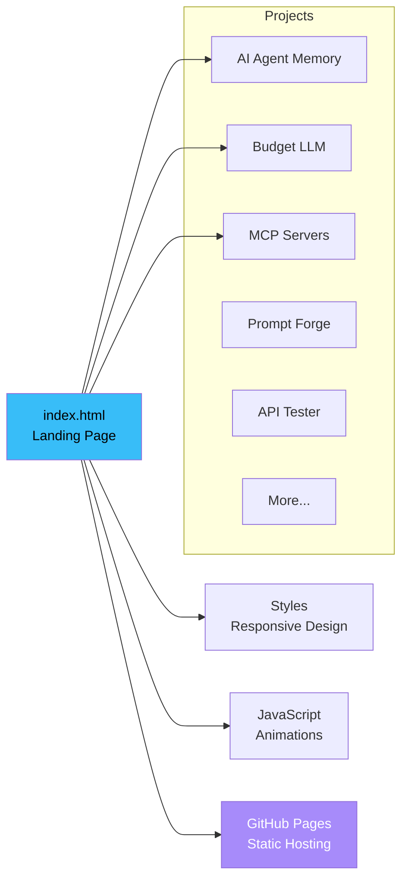

**Personal portfolio and project showcase.** Built with HTML/CSS, hosted on GitHub Pages.

[Visit Site](https://theihtisham.github.io) · [Projects](#-projects)

---

## Architecture

---

## Projects

| Project | Description | Stack |
|---------|-------------|-------|
| [AI Agent Memory](https://github.com/theihtisham/ai-agent-memory) | MCP memory server for AI agents | TypeScript, SQLite |
| [Budget LLM](https://github.com/theihtisham/budget-llm) | Smart LLM cost routing proxy | TypeScript, Express |
| [AI Prompt Forge](https://github.com/theihtisham/ai-prompt-forge) | Prompt engineering toolkit | Python, Click |
| [MCP Stripe Server](https://github.com/theihtisham/mcp-stripe-server) | Stripe via natural language | TypeScript, Stripe |
| [API Tester](https://github.com/theihtisham/devtools-api-tester) | Open-source Postman alternative | Next.js, Monaco |
| [Agent Starter Kit](https://github.com/theihtisham/agent-starter-kit) | AI agent production framework | Next.js, Stripe |
| [AI PR Reviewer](https://github.com/theihtisham/ai-pr-reviewer-action) | Automated code review | GitHub Action |
| [AI Release Notes](https://github.com/theihtisham/ai-release-notes) | Auto release note generation | GitHub Action |

---

## Links

- **Portfolio**: [theihtisham.github.io](https://theihtisham.github.io)
- **GitHub**: [github.com/theihtisham](https://github.com/theihtisham)
- **npm**: [npmjs.com/~theihtisham](https://www.npmjs.com/~theihtisham)
- **Email**: [Theihtisham@outlook.com](mailto:Theihtisham@outlook.com)

---

## License

MIT License — see [LICENSE](LICENSE) for details.

---

**Built by [theihtisham](https://github.com/theihtisham)**

